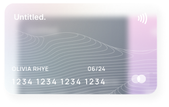

# 💸 FXDX Financial Dashboard

A beautiful, modern financial dashboard built with Next.js, React, and Tailwind CSS. Effortlessly manage your cards, track transactions, analyze spending, and generate insightful financial reports—all in one elegant interface.



---

## ✨ Features

- **Dashboard Overview**: Instantly view your balances, recent activity, and key financial stats.
- **Cards Management**: Add, view, and manage multiple payment cards with stylish card visuals and quick actions.
- **Transaction History**: Search, filter, and paginate through all your personal, business, and credit transactions.
- **Analytics**: Interactive charts for income, expenses, savings, spending by category, weekly patterns, and progress toward financial goals.
- **Reports**: Generate and download detailed financial, tax, expense, and investment reports. Quick stats and one-click report generation.
- **Responsive & Accessible**: Fully responsive design with accessible UI components.
- **Dark Mode**: Beautiful light and dark themes out of the box.

---

## 🛠️ Tech Stack

- [Next.js](https://nextjs.org/) 15
- [React](https://react.dev/) 19
- [Tailwind CSS](https://tailwindcss.com/) 4
- [Recharts](https://recharts.org/) (data visualization)
- [Lucide React](https://lucide.dev/) (icons)

---

## 🚀 Getting Started

1. **Install dependencies:**

   ```bash
   npm install
   # or
   yarn install
   ```

2. **Run the development server:**

   ```bash
   npm run dev
   # or
   yarn dev
   ```

3. **Open your browser:**

   Visit [http://localhost:3000](http://localhost:3000) to view the app.

---

## 📁 Project Structure

- `src/app/` — App entry, layout, and global styles
- `src/components/dashboard/` — Dashboard, cards, analytics, reports, sidebar, and more
- `src/components/ui/` — Reusable UI components (button, input, label)
- `public/` — Static assets (images, icons)

---

## 🎨 Customization & Theming

- Built with Tailwind CSS and custom CSS variables for easy theming
- Supports light and dark mode

---

## 📜 License

MIT
